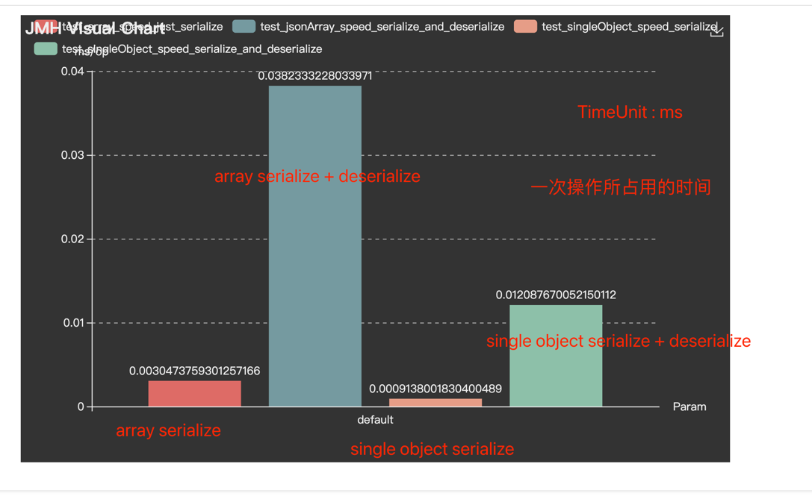

# JSON

## Introduction

朴素的 JSON 序列化工具. 基于 Field 实现.

速度不快, 只是避免较多反序列化漏洞而诞生. 

支持类型:

1. JSON ORM by serialize/deserialize
2. 支持 enum
3. 支持 范型 <T> (But @author 不推荐使用)
4. 支持 pretty
5. 各种日期, 序列化成 string = "yyyy-MM-dd HH:mm:ss" 格式

推荐:

1. 尽量使用纯实体的数据结构, 而非 interface / abstract 作为 json 载体.
2. 不追求速度
3. 删减第三方依赖, 和第二方工具库

# Download

## maven

```xml

<dependency>
    <groupId>com.neko233</groupId>
    <artifactId>json-java</artifactId>
    <version>0.1.0</version>
</dependency>
```

## gradle

```kotlin
implementation("com.neko233:json-java:0.1.0")

```

## JMH Speed Test



测速结论:

1. 线性增长耗时。

单个 object serialize ~= 100w+/s
单个 object serialize + deserialize ~= 30+w/s
数组 object serialize + deserialize ~= 100w+ / n 个对象 /s
3 object List ~= 32w+/s
数组 object serialize + deserialize ~= 30+w / n 个对象 /s
3 object list ~= 10w+/s

## JDK Compatibility | JDK 版本支持

Latest supported versions:

JDK 8 = 0.1.0

JDK 11 = 0.1.0

JDK 17 = 0.1.0

## Key Terminology | 术语

1. serialize: 序列化. JSON String -> Object
2. deserialize : 反序列化. Object -> JSON String

# License

json-java is licensed under Apache 2.0.

## Download

### Maven

```xml

<dependency>
    <groupId>com.neko233</groupId>
    <artifactId>json-java</artifactId>
    <version>0.1.0</version>
</dependency>

```

### Gradle

```groovy
implementation group: 'com.neko233', name: 'json-java', version: '0.1.0'
```

# Code

## Demo

```java
        String serialize=JSON.serialize(person);
        Person reTestSpeedPerson=JSON.deserialize(serialize,Person.class);

        System.out.println("original = "+person);
        System.out.println("deserialize = "+reTestSpeedPerson);

        Assert.assertTrue(reTestSpeedPerson.equals(person));

```